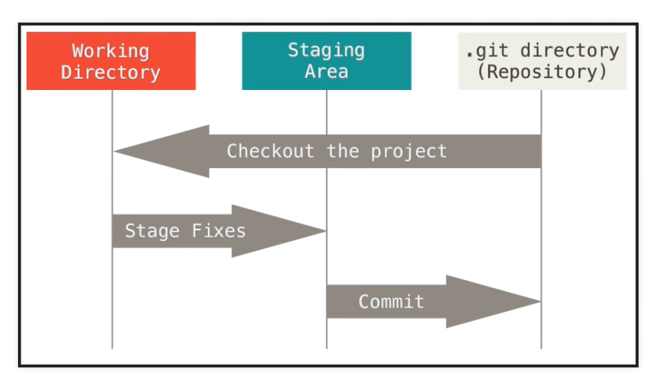

# git and github

### Todo's list

- [ ]  Enable 2FA on Samsung and iPhone August 5, 2021
- [ ]  

---

---

### Youtube tutorials. Unfinished.

[What is Git | What is GitHub | Git Tutorial | GitHub Tutorial | Devops Tutorial | Edureka](https://youtu.be/xuB1Id2Wxak)

From the video above: `Timestamp` : 46:54 here so after you're signed in you'll

```bash
git init
git remote add origin "https://github.com/Randeoch/hello-world.git"
git pull origin main

git push origin main

git config --list
git config --global user.name "Alex Bobryshev"
git config --global user.email "alex.bobryshev@gmail.com"\

#I would strongly advise to watch the whole video because it's a gre at source of information, but for those reviewing the content or looking for a specific concept, here's an overview:
0:00 - Introduction
1:31 - Distributed vs Central Version Control
3:17 - Installing Git
3:39 - First Time Setup
6:36 - Getting Started (Local repository)
10:41 - Git File Control
14:55 - Getting Started (Remote repository)
20:37 - Branching
27:38 - Faster Example
29:41 - Conclusion
```

```bash
Terminal commands:

On initial 

git --version - checks the version of the installed locally 
git config --global user.name "Your Name" - sets up the name of the user 
git config --global user.email "yourname@somemail.eu" - sets up the mail of the user

config --list - lists all the git configurations

For initializing the project:

git init - initializes the git repo in the current folder
touch .gitignore - creates a git ignore file
git status - check working tree - both on the git and on local 

Add files:
git add -A - adds all of the files for commiting

Remove files: 
git reset - removes files to be commited 
git reset somefile.js - removes somefile.js from the commit preparation

Committing:
git commit -m "This is the commit message" - -m is used to add message

Check log:
git log - renders commit ids, authors, dates

Clone a remote repo:
git clone <url> <where to clone>

View info about the repo:
git remote -v - lists info about the repo
git branch -a - lists all of the branches

View changes:
git diff - shows the difference made in the files

Pull before push ALWAYS:
git pull origin master

THEN PUSH:
git push origin master - <origin> name of remote repo <master> the branch that we push to 

First time push of the branch:
git push -u origin <name of the branch> - -u coordinates the two branches (local and on server)

Create a branch:
git branch <name of the branch>

Checkout a branch:
git checkout <name of the branch>

Merge a branch:
git checkout master
git pull origin master
git branch --merged - see which branches are merged 
git merge <name of the branch you want to merge>
git push origin master 

Delete a branch:
git branch -d <name of the branch> - this deletes it locally!!!
git branch -a - check the repo branches 
git push origin --delete <name of the branch> - this deletes it from the repo!
```


